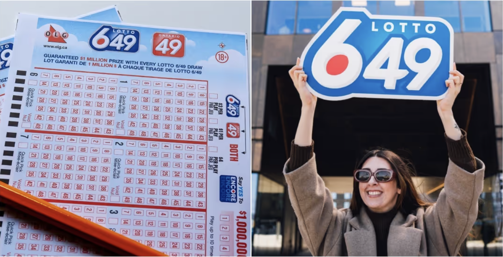

# Lottery Probability Analysis for Responsible Gambling

## Introduction

A renowned medical institute focused on preventing and treating gambling addiction is developing a mobile application to assist lottery players in making informed decisions about their chances of winning. While their in-house engineering team is responsible for app development, our task is to design and implement the probability calculation engine that powers the app's insights.

For the initial release, our focus is on the 6/49 lottery. We will build core functions that allow users to answer key probability-related questions, including:

What are the odds of winning the jackpot with a single ticket?

How does purchasing multiple tickets impact the probability of winning?

What is the likelihood of matching a specific number of winning numbers (e.g., two, three, four, or five)?

## Core Probability Concepts

To determine lottery odds, we rely on two key mathematical functions: **factorial** and **combination**. The factorial function calculates the product of all positive integers up to a given number, while the combination function computes the number of ways to choose a subset of elements from a larger set.

Using these functions, we can determine the total number of possible lottery outcomes and assess the probability of any given ticket winning. For example, number of possible outcomes of Canada 6/49 Lottery is **13,983,816**.

## Winning Probability for a Single Ticket

In the 6/49 lottery, six numbers are randomly drawn from a set of 49. A player wins the jackpot only if all six numbers on their ticket match the drawn numbers exactly. Even a single number mismatch results in a loss.

To help players understand their odds, we calculate the probability of winning with a single ticket and present the results in a user-friendly format. The probability of winning the jackpot is extremely low, at approximately **0.0000071511%**. This means a player would need to buy nearly 7 million tickets to have a 50% chance of winning.

## Historical Data Analysis for Canada 6/49 Lottery

To provide additional insights, we analyze historical data from the Canada 6/49 lottery, available on Kaggle. The dataset contains records of 3,665 drawings from 1982 to 2018. Each draw has six winning numbers recorded, allowing us to examine patterns and occurrences of specific number combinations.

## Checking Historical Occurrences of a Ticket

One of the key features of our analysis is allowing users to check how many times their selected ticket has appeared in past lottery draws. By comparing the user's selection against historical records, we provide insights into whether their chosen numbers have ever won before. However, past occurrences do not influence future draws, as each lottery draw is an independent event.

## Multi-Ticket Probability

Many lottery players buy multiple tickets to increase their odds. To help them assess the impact, we calculate the probability of winning based on the number of tickets purchased. For example:

- Winning probability with 1 ticket: 0.0000%
- Winning probability with 10 tickets: 0.0001%
- Winning probability with 100 tickets: 0.0007%
- Winning probability with 10,000 tickets: 0.0715%
- Winning probability with 1,000,000 tickets: 7.1511%
- Winning probability with 6,991,908 tickets: 50.0000%
- Winning probability with 13,983,816 tickets: 100.0000%

## Probability of Winning Smaller Prizes

In most 6/49 lotteries, players can win smaller prizes by matching two, three, four, or five numbers. Our analysis calculates the probability of achieving these partial matches. For example:

- Probability of winning a prize with 2 matching numbers: 13.2378029002%
- Probability of winning a prize with 3 matching numbers: 1.7650403867%
- Probability of winning a prize with 4 matching numbers: 0.0968619724%
- Probability of winning a prize with 5 matching numbers: 0.0018449900%
- Probability of winning a prize with 6 matching numbers: 0.0000071511%

Additionally, we calculate the probability of having at least a certain number of winning numbers, which provides further insight into potential winnings.

- Probability of winning a prize with at least 2 matching numbers: 15.1015574004%
- Probability of winning a prize with at least 3 matching numbers: 1.8637545002%
- Probability of winning a prize with at least 4 matching numbers: 0.0987141135%
- Probability of winning a prize with at least 5 matching numbers: 0.0018521411%
- Probability of winning a prize with at least 6 matching numbers: 0.0000071511%

## Conclusion

By leveraging mathematical probability and historical data analysis, our engine provides clear insights into lottery odds. The findings emphasize the extremely low probability of winning the jackpot, promoting responsible gambling habits. With these insights, lottery players can make more informed decisions and set realistic expectations about their chances of winning.

